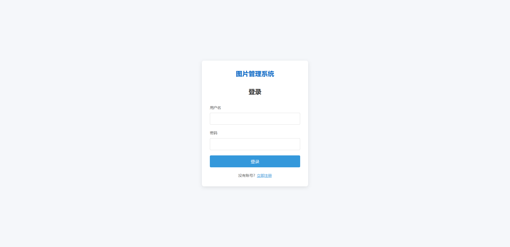
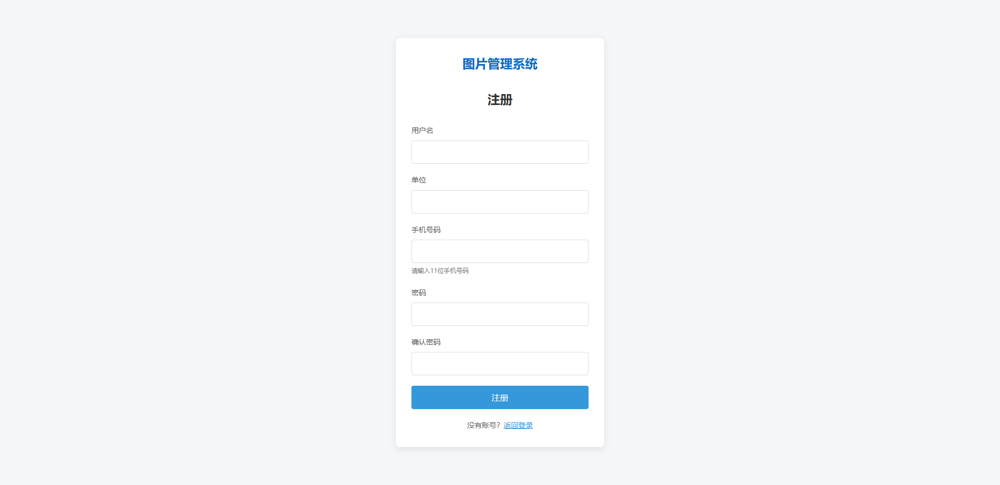
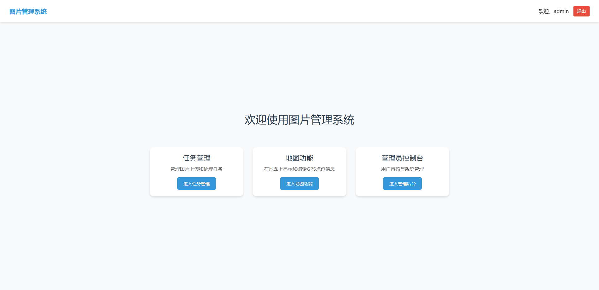
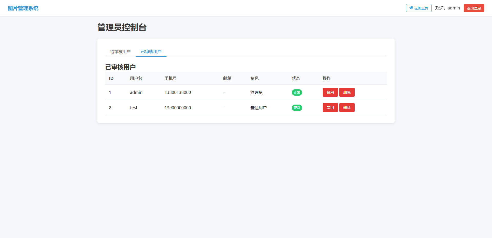
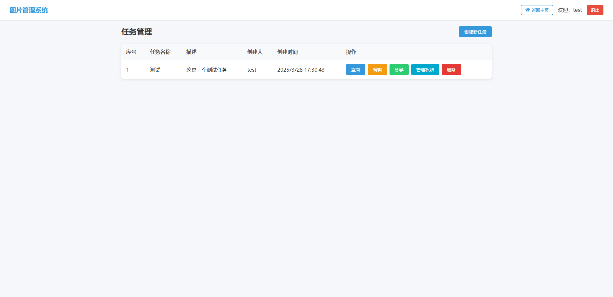
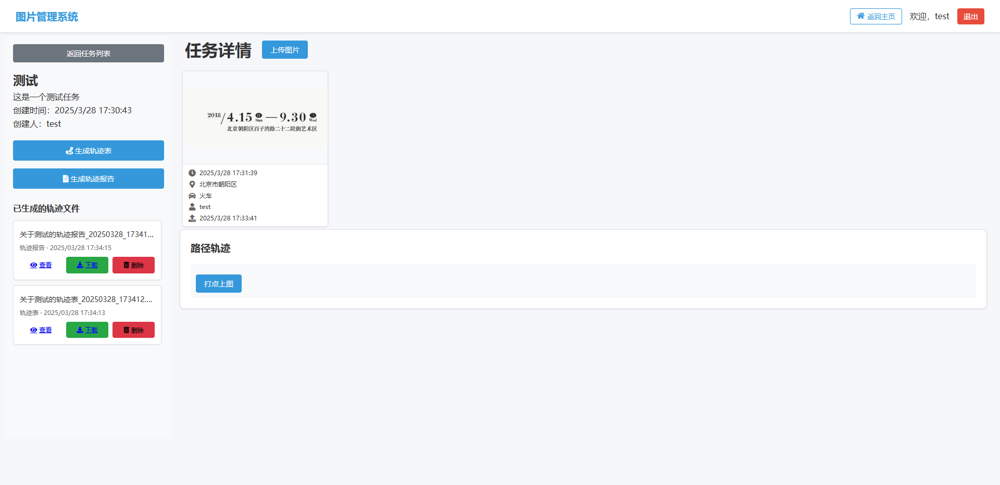
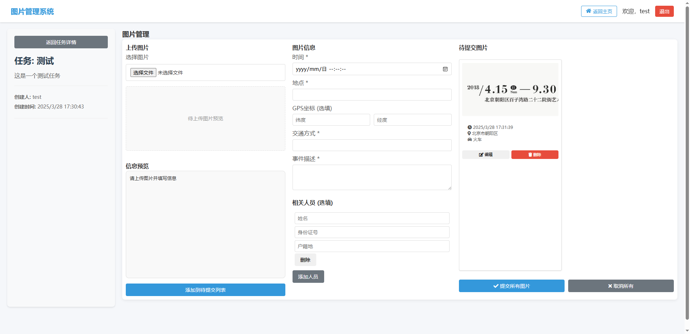
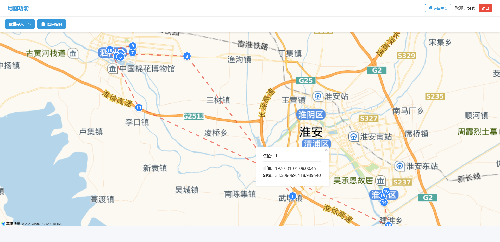
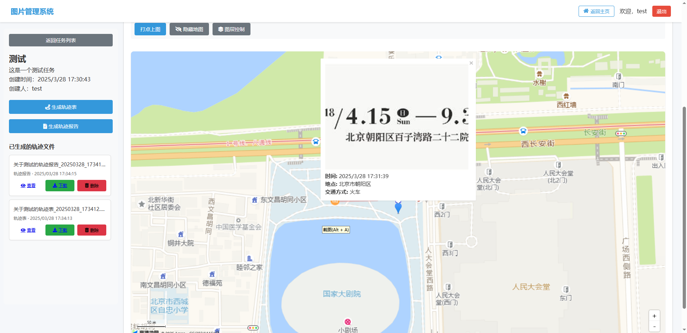

# 图片管理系统

基于FastAPI和原生JavaScript构建的图片管理系统，专为地理信息与轨迹数据分析设计，用于管理、展示和生成轨迹报告。

## 项目概述

本系统是一个轻量级但功能完善的图片管理工具，主要功能包括：

- 用户注册与登录管理，多级权限控制
- 任务创建与管理，支持团队协作
- 图片上传与管理，支持批量操作
- GPS轨迹记录与高德地图可视化展示
- 轨迹报告自动生成（支持Excel和Word格式）
- 响应式设计，支持移动设备访问
- JWT密钥自动轮换机制，增强系统安全性

## 中文编码优化

为确保系统在处理中文时不出现乱码问题，本项目进行了全面的编码优化：

- **Python文件编码**：所有Python文件添加 `# -*- coding: utf-8 -*-` 编码声明
- **数据库编码**：MySQL数据库使用 `utf8mb4` 字符集和 `utf8mb4_unicode_ci` 排序规则
- **数据库连接**：SQLAlchemy连接字符串添加 `charset=utf8mb4` 参数
- **前端文件**：所有HTML文件均设置 `<meta charset="UTF-8">` 标签
- **环境配置**：`.env` 文件使用UTF-8编码保存，并设置 `env_file_encoding="utf-8"`
- **文件操作**：所有文件读写操作指定 `encoding='utf-8'` 参数
- **日志系统**：日志配置使用UTF-8编码输出
- **API响应**：确保所有API响应包含正确的中文字符编码

这些优化确保系统能够正确处理中文字符，包括用户名、任务描述、地点名称和报告内容等，避免在数据存储、传输和显示过程中出现乱码问题。

## 技术栈

- **后端**：FastAPI (Python 3.8+)
- **数据库**：MySQL 5.7+ / 8.0
- **前端**：原生JavaScript、HTML5、CSS3
- **地图服务**：离线高德地图瓦片
- **文档生成**：python-docx, pandas, openpyxl
- **认证**：JWT认证，密码加密存储，自动密钥轮换

## 项目结构

```
.
├── backend/                 # 后端代码
│   ├── db/                  # 数据库相关
│   │   ├── database.py      # 数据库连接配置
│   │   └── initialize_db.py # 数据库初始化脚本
│   ├── models/              # 数据模型
│   │   └── models.py        # SQLAlchemy模型定义
│   ├── routers/             # API路由
│   │   ├── base.py          # 基础API，处理前端页面渲染
│   │   ├── users.py         # 用户相关API，包括认证和权限
│   │   ├── tasks.py         # 任务相关API
│   │   ├── images.py        # 图片相关API
│   │   ├── trajectory.py    # 轨迹生成相关API
│   │   └── map.py           # 地图相关API
│   ├── utils/               # 工具函数
│   │   ├── logger.py        # 日志配置工具
│   │   └── key_manager.py   # JWT密钥管理工具
│   └── migrations/          # 数据库迁移脚本
│       └── versions/        # 迁移版本
├── frontend/                # 前端代码
│   ├── static/              # 静态资源
│   │   ├── css/             # 样式表
│   │   └── js/              # JavaScript脚本
│   │       ├── app.js       # 主应用脚本
│   │       ├── map.js       # 地图功能脚本
│   │       ├── task-manager.js # 任务管理脚本
│   │       ├── trajectory.js # 轨迹处理脚本
│   │       ├── MAP_zxy/     # 离线地图瓦片资源
│   │       └── utils.js     # 工具函数脚本
│   ├── index.html           # 首页
│   ├── login.html           # 登录页
│   ├── admin.html           # 管理员页面
│   ├── task.html            # 任务列表页
│   ├── upload.html          # 任务详情和上传页
│   ├── image.html           # 图片管理页面
│   └── map.html             # 地图功能页面
├── uploads/                 # 上传文件存储目录
├── outputs/                 # 生成的报告存储目录
├── logs/                    # 日志文件目录
├── keybackups/              # JWT密钥备份目录
├── main.py                  # 主程序入口
├── config.py                # 配置文件
├── check_key_status.py      # JWT密钥状态检查工具
├── rotate_key.py            # JWT密钥手动轮换工具
├── key_management_readme.md # JWT密钥管理说明文档
├── requirements.txt         # 依赖包列表
├── .env.example             # 环境变量示例
├── .env                     # 环境变量配置(本地开发使用，不提交到版本控制)
└── README.md                # 项目说明文档
```

## 环境要求

- Python 3.8+
- MySQL 5.7+ 或 8.0+
- 现代浏览器（Chrome, Firefox, Edge等）

## 快速开始

### 1. 克隆项目

```bash
git clone https://github.com/jeja2023/tp.git
cd tp
```

### 2. 创建虚拟环境

```bash
python -m venv venv
source venv/bin/activate  # Linux/Mac
venv\Scripts\activate     # Windows
```

### 3. 安装依赖

```bash
pip install -r requirements.txt
```

### 4. 配置环境变量

1. 复制环境变量示例文件：
```bash
cp .env.example .env
```

2. 修改`.env`文件中的配置：
   - 设置数据库连接信息
   - 设置管理员账户信息

### 5. 创建数据库

```sql
CREATE DATABASE tp CHARACTER SET utf8mb4 COLLATE utf8mb4_unicode_ci;
```

### 6. 运行应用

```bash
python main.py
```

访问 http://localhost:8000 开始使用

## 主要功能与界面

### 1. 用户管理
- 用户注册和登录
- 角色权限控制（管理员、普通用户）
- 个人信息管理






### 2. 任务管理
- 创建和管理任务
- 任务状态跟踪
- 任务详情查看与分享





### 3. 图片管理
- 图片上传和预览
- 图片分类管理
- 图片信息编辑与地理位置标记



### 4. GPS轨迹
- GPS数据导入（支持Excel格式）
- 轨迹地图可视化显示
- 轨迹数据分析与编辑



### 5. 报告生成
- 支持Excel格式导出
- 支持Word格式导出
- 自定义报告模板与内容



### 6. JWT密钥管理
- 自动密钥轮换机制（默认30天）
- 密钥状态检查工具
- 手动密钥轮换工具
- 密钥备份与恢复机制

## 离线地图资源

本项目使用高德地图的离线瓦片资源，存储在 `frontend/static/js/MAP_zxy/` 目录下。这些资源包括：

- 地图瓦片文件（PNG格式）
- 缩放级别：1-11级
- 覆盖范围：根据实际需求定制

### 离线地图使用说明

1. 系统默认使用离线地图资源，无需联网即可使用
2. 地图瓦片按缩放级别（z）和坐标（x,y）组织存储
3. 支持离线轨迹显示和标记点功能
4. 地图显示已优化，仅显示必要的地图要素

### 离线地图资源管理

1. 瓦片资源存储在 `frontend/static/js/MAP_zxy/` 目录
2. 目录结构：`z/x/y.png`
   - z: 缩放级别（1-11）
   - x: 瓦片X坐标
   - y: 瓦片Y坐标
3. 资源文件已通过 `.gitignore` 配置，不会上传到版本控制系统
4. 首次部署时需要手动添加离线地图资源

## JWT密钥管理

本系统实现了JWT密钥自动管理机制，提供了以下功能：

### 1. 自动密钥轮换
- 系统会自动检测并在密钥过期时轮换
- 默认轮换周期为30天
- 轮换过程自动完成，无需人工干预

### 2. 密钥状态检查
使用 `check_key_status.py` 工具可以检查密钥状态：
```bash
python check_key_status.py
```
输出信息包括：
- 上次密钥轮换时间
- 下次计划轮换时间
- 距离下次轮换的天数
- 密钥文件权限状态
- 密钥备份状态

### 3. 手动密钥轮换
在特殊情况下，可以使用 `rotate_key.py` 工具手动轮换密钥：
```bash
python rotate_key.py        # 仅在当前密钥过期时轮换
python rotate_key.py --force # 强制轮换密钥，无论是否过期
```

### 4. 密钥备份管理
- 系统自动在 `keybackups/` 目录下维护密钥备份
- 每次轮换前会自动备份当前密钥
- 在密钥验证失败时，系统会尝试使用备份密钥恢复

更多详细信息，请参阅 `key_management_readme.md` 文件。

## 开发指南

### 代码规范
- 遵循PEP 8规范
- 使用类型注解
- 编写详细的文档字符串

### 数据库迁移
使用Alembic进行数据库迁移管理：

```bash
# 创建迁移
alembic revision --autogenerate -m "描述你的更改"

# 应用迁移
alembic upgrade head

# 回滚迁移
alembic downgrade -1
```

### API文档
启动应用后访问：
- Swagger UI: http://localhost:8000/docs
- ReDoc: http://localhost:8000/redoc

## 部署指南

### 生产环境部署

1. 安装生产环境依赖：
```bash
pip install -r requirements.txt
pip install gunicorn
```

2. 配置环境变量：
```bash
cp .env.example .env
# 编辑.env文件，设置生产环境配置
```

3. 使用Gunicorn启动：
```bash
gunicorn -w 4 -k uvicorn.workers.UvicornWorker main:app --bind 0.0.0.0:8000
```

### Docker部署

1. 构建镜像：
```bash
docker build -t tp-image-management-system .
```

2. 运行容器：
```bash
docker run -d --name tp-app \
  -p 8000:8000 \
  -v $(pwd)/uploads:/app/uploads \
  -v $(pwd)/outputs:/app/outputs \
  -v $(pwd)/logs:/app/logs \
  -v $(pwd)/keybackups:/app/keybackups \
  --env-file .env \
  tp-image-management-system
```

## 安全注意事项

1. `.env`文件包含敏感信息，确保：
   - 不要将其提交到版本控制系统
   - 在生产环境中使用强密码
   - 通过密钥管理工具管理JWT密钥

2. 数据库安全：
   - 使用强密码
   - 限制数据库用户权限
   - 定期备份数据

3. 密钥安全：
   - 使用自动密钥轮换功能增强安全性
   - 保持密钥备份目录的安全
   - 定期检查密钥状态

## 常见问题

### 1. JWT认证问题
- 如果遇到身份验证失败，尝试退出并重新登录
- 检查密钥是否已正确轮换，使用 `check_key_status.py` 检查
- 如有必要，使用 `rotate_key.py --force` 强制轮换密钥

### 2. 数据库连接问题
- 检查数据库服务是否运行
- 验证数据库连接信息是否正确
- 确认数据库用户权限

### 3. 文件上传问题
- 检查上传目录权限
- 确认文件大小限制
- 验证文件类型限制

## 贡献指南

欢迎贡献代码、报告问题或提出改进建议：
1. Fork 项目
2. 创建特性分支 (`git checkout -b feature/amazing-feature`)
3. 提交更改 (`git commit -m 'Add some amazing feature'`)
4. 推送到分支 (`git push origin feature/amazing-feature`)
5. 创建Pull Request

## 许可证

MIT License

## 联系方式

- 项目维护者：[jeja2023](https://github.com/jeja2023)
- 项目仓库：[https://github.com/jeja2023/tp](https://github.com/jeja2023/tp)
- 问题反馈：请在GitHub仓库中提交Issue